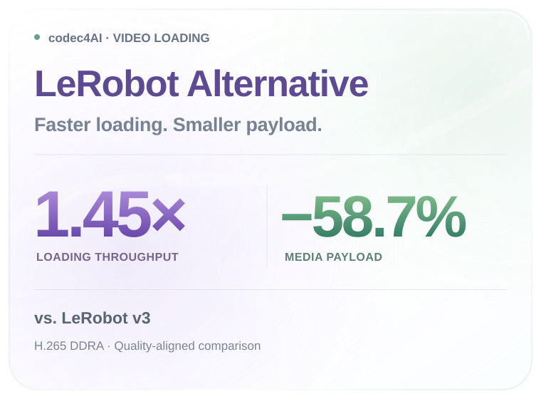

<h1 align="center"></h1>

<h3 align="center">Rethinking Video Storage for AI Training:<br />Breaking Cross-Frame Dependencies for Efficient Random Access</h3>

<p align="center">
  <a href="#method"></a>
  <a href="#method"></a>
  <a href="#quick-start"></a>
  <br />
  <a href="#contributions"></a>
  <a href="#lerobot-alternative"></a>
</p>

<p align="center"><a href="#paper"></a></p>

<p align="center"><b>English</b> · <a href="README_cn.md">简体中文</a></p>

<p align="center"><a href="#contributions">Contributions</a> · <a href="#method">Framework</a> · <a href="#quick-start">Quick Start</a> · <a href="#documentation">Documentation</a> · <a href="#citation">Citation</a></p>

<a id="lerobot-alternative"></a>
<p align="center">
  
  
</p>

Paper results: H.265 DDRA vs. LeRobot v3 at comparable reconstruction quality, across three robotics datasets and four access patterns.

<a id="contributions"></a>
## ✨ Contributions

- We analyze the video-storage requirements of AI training and identify two sources of decode amplification: sequential decoding of unrelated frames and transitive frame dependencies.
- We combine dependency-aware sparse decoding with DDRA encoding, eliminating unrelated frame reconstruction and bounding each interior target’s dependency closure while retaining inter-frame prediction.
- Experiments across three datasets and four access patterns demonstrate faster native video loading and, after quality-aligned transcoding, higher throughput with less media payload than LeRobot v3 and JPEG.

<a id="method"></a>
## 🧩 Framework

<p align="center"></p>

<a id="quick-start"></a>
## 🚀 Quick Start

Dependency-aware video loading for AI training. The Python distribution remains
**video-loader**, imported as **video_loader**. This repository packages version
**0.3.0** with public build inputs and GPL-3.0-or-later licensing.

It extracts selected RGB display frames from H.264, HEVC and AV1 MP4 files and
encodes NumPy videos with five H.264/HEVC presets. Paths and in-memory MP4 bytes
are both supported. Requested ordering and duplicate indices are preserved.

<a id="install"></a>

## 📦 Install

Download the wheel matching your Python, architecture and glibc version from
the project's release assets, then install the local file:

```bash
python -m pip install ./video_loader-0.3.0-*.whl
```

Install only one matching wheel at a time. The bundled build supports Linux
x86_64. The current locally verified release targets CPython 3.12; see
[release notes](docs/RELEASE_NOTES.md) for its exact wheel tag and checks.
This directory does not by itself imply that a release has been uploaded to
PyPI or GitHub. Do not assume that a similarly named PyPI project is this project.

Bundled wheels include the codec libraries and need NumPy plus the compatible
Python/Linux system runtime. They do not need an `ffmpeg` executable, a system
FFmpeg development installation, CUDA, PyTorch, or `LD_LIBRARY_PATH`.

<a id="use"></a>

## 🚀 Use

```python
import video_loader

info = video_loader.inspect("episode.mp4")
frames, metrics = video_loader.decode("episode.mp4", [17, 2, 17], return_info=True)
payload = video_loader.transcode(frames, fps=30, mode="fast265", crf=18)
```

For a runnable synthetic example without a dataset:

```bash
python examples/quickstart.py
```

| Mode | Codec | Intra period | B pictures | Entropy coding |
| --- | --- | --- | --- | --- |
| `base264` | H.264 | 32 | 3, hierarchical references | CABAC |
| `base265` | HEVC | 32 | 3, hierarchical references | CABAC |
| `fast264` | H.264 | 8 | 7, non-reference | CABAC |
| `fast265` | HEVC | 8 | 7, non-reference | CABAC |
| `ufast264` | H.264 | 8 | 7, non-reference | CAVLC |

The bundled FFmpeg patch exports H.264/HEVC reference graphs and supports
state-only packet processing. A build against compatible, unpatched FFmpeg
falls back to contiguous decoding and does not provide the sparse path.
AV1 currently decodes the complete packet set. `Video` does not cache indexes.
See the [API reference](docs/API.md) for metrics and limitations.

<a id="documentation"></a>

## 🛠️ Build, test and release

- [Building](docs/BUILDING.md): source builds and self-contained wheels.
- [Releasing](docs/RELEASING.md): validate and publish a complete release.
- [Dependencies and licensing](docs/DEPENDENCIES.md): runtime, build and test dependencies.
- [Release notes](docs/RELEASE_NOTES.md): supported artifacts and validation evidence.
- [Analytic tests](analysis/README.md): independent, dataset-free graph checks.
- [Research benchmark scripts](benchmarks/): minimally adapted original experiments; see the [dependency guide](docs/DEPENDENCIES.md) for additional requirements.

```bash
python -m pip install -r tools/build-requirements.txt
PYTHON=python bash tools/build_release.sh
python tools/verify_release.py releases/0.3.0/video_loader-0.3.0-*.whl
```

Native build prerequisites are listed in the build guide. Build in a clean
virtual environment. The script downloads hash-pinned public sources, applies
the FFmpeg patch, compiles the extension, repairs the wheel with `auditwheel`,
and creates an sdist, corresponding-sources archive, build manifest and SHA256 sums.

<a id="license"></a>

## 📜 License

Project source: [GPL-3.0-or-later](LICENSE). Bundled native code retains its
upstream licenses and notices in [licenses/](licenses) and [NOTICE](NOTICE).
Publish corresponding sources alongside binary wheels; the build script creates
that archive. FFmpeg is built with GPL components; see [its licensing documentation](https://ffmpeg.org/legal.html).

<a id="paper"></a>
## 📘 Paper

Paper link coming soon.

<a id="citation"></a>
## 📚 Citation

BibTeX coming soon.
