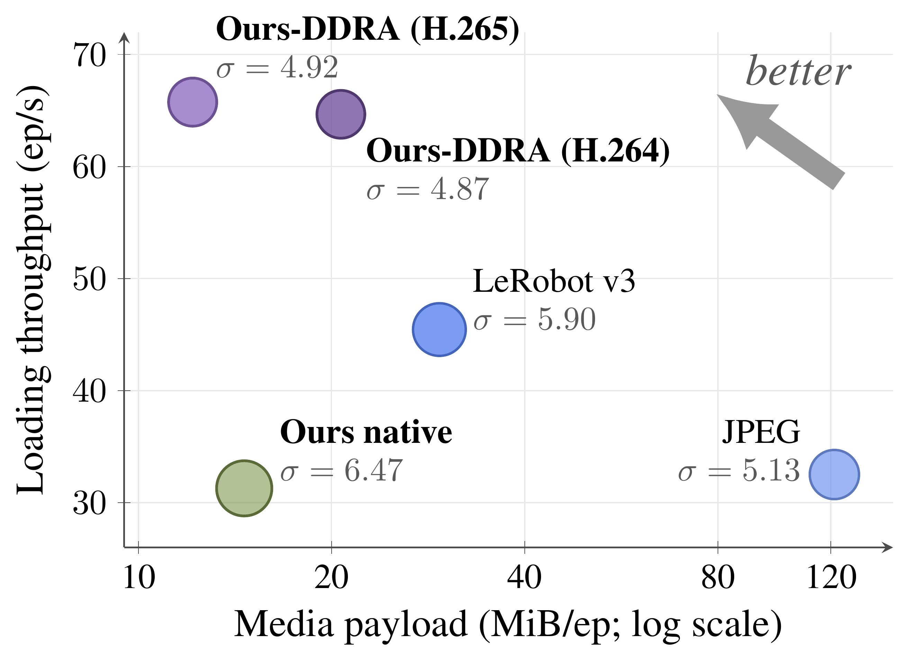
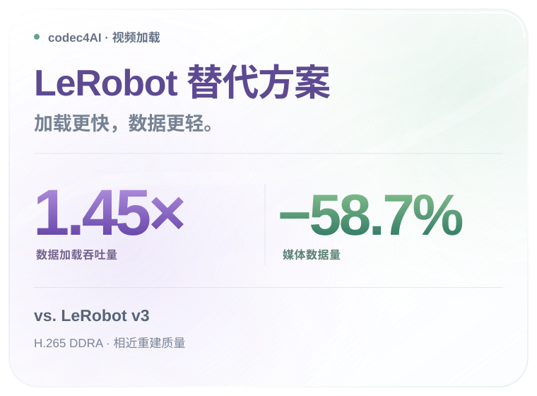
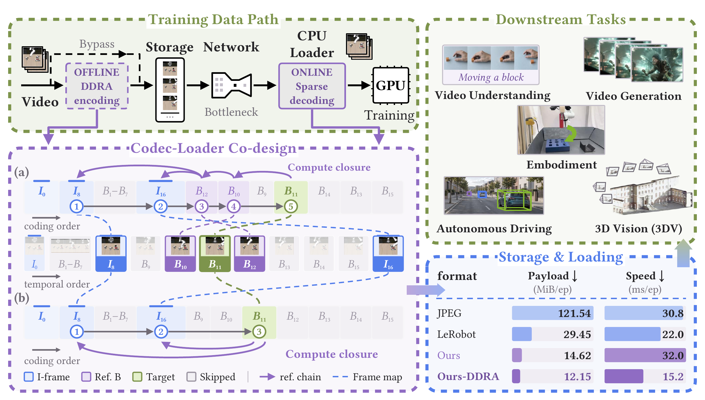

<h1 align="center"></h1>

<h3 align="center">Rethinking Video Storage for AI Training:<br />Breaking Cross-Frame Dependencies for Efficient Random Access</h3>

<p align="center">
  <a href="#method"></a>
  <a href="#method"></a>
  <a href="#quick-start"></a>
  <br />
  <a href="#contributions"></a>
  <a href="#lerobot-alternative"></a>
</p>

<p align="center"><a href="#paper"></a></p>

<p align="center"><a href="README.md">English</a> · <b>简体中文</b></p>

<p align="center"><a href="#contributions">Contributions</a> · <a href="#method">框架</a> · <a href="#quick-start">快速开始</a> · <a href="#documentation">文档</a> · <a href="#citation">引用</a></p>

<a id="lerobot-alternative"></a>
<p align="center">
  
  
</p>

论文实验：H.265 DDRA，在三个机器人数据集、四种访问模式、相近重建质量下与 LeRobot v3 对比。

<a id="contributions"></a>
## ✨ Contributions

- We analyze the video-storage requirements of AI training and identify two sources of decode amplification: sequential decoding of unrelated frames and transitive frame dependencies.
- We combine dependency-aware sparse decoding with DDRA encoding, eliminating unrelated frame reconstruction and bounding each interior target’s dependency closure while retaining inter-frame prediction.
- Experiments across three datasets and four access patterns demonstrate faster native video loading and, after quality-aligned transcoding, higher throughput with less media payload than LeRobot v3 and JPEG.

<a id="method"></a>
## 🧩 框架

<p align="center"></p>

<a id="quick-start"></a>
## 🚀 快速开始

面向 AI 训练的依赖感知视频加载工具。Python 分发包名仍为 **video-loader**，
导入名为 **video_loader**。本仓库使用公开的构建输入，以 GPL-3.0-or-later
许可提供 **0.3.0** 版本。

本工具从 H.264、HEVC 和 AV1 MP4 文件中提取指定的 RGB 显示帧，并使用五种
H.264/HEVC 预设对 NumPy 视频编码。输入支持文件路径和内存中的 MP4 字节数据，
返回结果保留请求顺序和重复索引。

<a id="install"></a>

## 📦 安装

从项目发行版附件中下载与 Python、架构和 glibc 版本匹配的 wheel，再安装本地文件：

```bash
python -m pip install ./video_loader-0.3.0-*.whl
```

每次只安装一个匹配的 wheel。包含原生库的构建支持 Linux x86_64。
当前经过本地验证的发行版面向 CPython 3.12；具体 wheel 标签和检查结果见
[发行说明](docs/RELEASE_NOTES_cn.md)。本目录的存在不代表发行产物已经上传到
PyPI 或 GitHub，也不能将 PyPI 上名称相近的项目视为本项目。

bundled wheel 包含编解码库，仍需要 NumPy 和兼容的 Python/Linux 系统运行环境。
它不需要 `ffmpeg` 可执行文件、系统 FFmpeg 开发库、CUDA、PyTorch 或
`LD_LIBRARY_PATH`。

<a id="use"></a>

## 🚀 使用

```python
import video_loader

info = video_loader.inspect("episode.mp4")
frames, metrics = video_loader.decode("episode.mp4", [17, 2, 17], return_info=True)
payload = video_loader.transcode(frames, fps=30, mode="fast265", crf=18)
```

无需准备数据集即可运行自动生成视频的示例：

```bash
python examples/quickstart.py
```

| 模式 | 编解码标准 | 帧内周期 | B 帧 | 熵编码 |
| --- | --- | --- | --- | --- |
| `base264` | H.264 | 32 | 3，分层参考 | CABAC |
| `base265` | HEVC | 32 | 3，分层参考 | CABAC |
| `fast264` | H.264 | 8 | 7，非参考帧 | CABAC |
| `fast265` | HEVC | 8 | 7，非参考帧 | CABAC |
| `ufast264` | H.264 | 8 | 7，非参考帧 | CAVLC |

随附的 FFmpeg 补丁导出 H.264/HEVC 参考图，并支持仅更新状态的数据包处理。
使用兼容但未打补丁的 FFmpeg 构建时，会回退到连续解码，不提供稀疏解码路径。
AV1 当前解码完整的数据包集合。`Video` 不缓存索引。
指标和限制见 [API 参考](docs/API_cn.md)。

<a id="documentation"></a>

## 🛠️ 构建、测试与发布

- [构建教程](docs/BUILDING_cn.md)：源码构建和包含原生依赖的 wheel。
- [发布教程](docs/RELEASING_cn.md)：验证并发布完整发行版。
- [依赖与许可](docs/DEPENDENCIES_cn.md)：运行、构建和测试依赖。
- [发行说明](docs/RELEASE_NOTES_cn.md)：支持的产物及验证记录。
- [理论模型测试](analysis/README_cn.md)：独立且无需数据集的图模型检查。
- [研究基准脚本](benchmarks/)：经过最小适配的原始实验脚本，额外环境要求见
  [依赖说明](docs/DEPENDENCIES_cn.md)。

```bash
python -m pip install -r tools/build-requirements.txt
PYTHON=python bash tools/build_release.sh
python tools/verify_release.py releases/0.3.0/video_loader-0.3.0-*.whl
```

原生构建所需工具见构建教程，请在干净的虚拟环境中构建。脚本会下载通过哈希锁定的
公开源码，应用 FFmpeg 补丁，编译扩展，使用 `auditwheel` 修复 wheel，并生成 sdist、
对应源码归档、构建清单和 SHA256 校验和。

<a id="license"></a>

## 📜 许可

项目源码采用 [GPL-3.0-or-later](LICENSE)。随附原生代码保留其上游许可和声明，
见 [licenses/](licenses) 与 [NOTICE](NOTICE)。发布二进制 wheel 时应同时提供
对应源码，构建脚本会生成该归档。FFmpeg 构建启用了 GPL 组件，详见
[FFmpeg 许可说明](https://ffmpeg.org/legal.html)。

<a id="paper"></a>
## 📘 Paper

论文链接待补充。

<a id="citation"></a>
## 📚 Citation

BibTeX 待补充。
